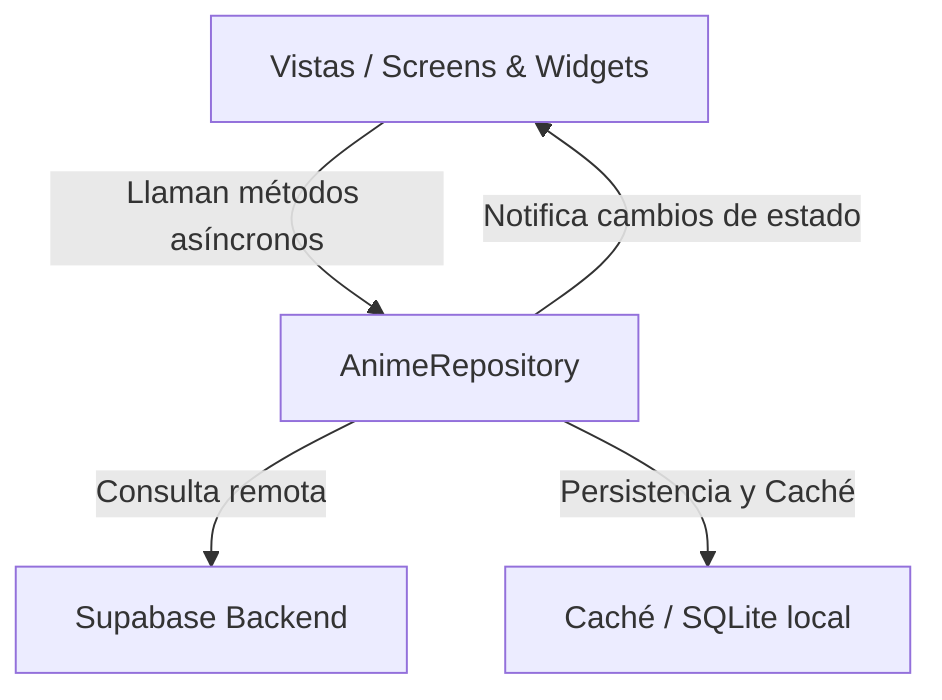

# 🎓 Guía Suprema de Defensa Académica: Proyecto "Tomodachi"

Esta guía ha sido diseñada para que comprendas a la perfección la arquitectura, patrones de diseño y decisiones tecnológicas de tu aplicación **Tomodachi**. Te servirá para exponer y defender el proyecto ante tu profesor con total solidez técnica.

---

## 🏗️ 1. Arquitectura General y Patrones de Diseño

El proyecto está estructurado siguiendo un patrón derivado de **Clean Architecture** y **MVVM** (Model-View-ViewModel), conocido como **MVR (Model-View-Repository)**:

### Elementos Clave de la Arquitectura:
1. **Modelos (`lib/models/`):** Clases puras de Dart (como `Anime`) que mapean las respuestas JSON de la base de datos a objetos tipados fuertemente en memoria (`fromMap` y `toMap`).
2. **Repositorios (`lib/repositories/`):** Centralizan el acceso a los datos. `AnimeRepository` decide si los datos se obtienen de la nube (Supabase) o si se sirven desde la caché local cuando el dispositivo no tiene conexión a internet.
3. **Vistas (`lib/screens/` y `lib/widgets/`):** Reactivas. Pintan la UI en función del estado actual y llaman al repositorio para disparar acciones.

---

## 🚀 2. Características Técnicas de Nivel Avanzado (Para impresionar al Profesor)

Si tu profesor te pregunta por detalles de optimización o técnicas avanzadas implementadas, destaca estos cuatro puntos:

### A. Actualizaciones Optimistas (Optimistic UI)
* **Dónde se usa:** Al guardar un anime en la lista, marcarlo como pendiente o quitarlo (`_quickSaveAnime` en [home_screen.dart](file:///c:/Users/anaru/Downloads/proyectomoviles%20app/anime_list_app/lib/screens/home_screen.dart)).
* **Qué es:** En lugar de mostrar un spinner y esperar a que Supabase confirme que el anime ha sido guardado, la aplicación actualiza **inmediatamente** la interfaz en local simulando que la acción ha tenido éxito. En segundo plano, se lanza la consulta de red.
* **Por qué es avanzado:** Si la consulta remota tiene éxito, la app sigue fluyendo sin esperas. Si falla (por falta de red, por ejemplo), el bloque `catch` revierte el estado local mediante un `setState` al valor anterior y muestra un `SnackBar` rojo informando al usuario. Esto hace que la app se sienta instantánea.

### B. Búsqueda en Tiempo Real con Debouncing
* **Dónde se usa:** En los buscadores del catálogo (`HomeScreen`), colecciones (`MyListScreen`) y grupos.
* **Qué es:** Cuando el usuario teclea en el buscador, la app no lanza una consulta a Supabase por cada letra escrita (lo que saturaría el servidor). En su lugar, se implementa un `Timer` de 500ms. Cada vez que el usuario pulsa una tecla, el temporizador se reinicia. Solo cuando pasa medio segundo sin teclear, se ejecuta la petición.
* **Beneficio:** Ahorro masivo en transferencia de datos y rendimiento de red óptimo.

### C. IndexedStack (Mantenimiento de Estado)
* **Dónde se usa:** En [main_layout.dart](file:///c:/Users/anaru/Downloads/proyectomoviles%20app/anime_list_app/lib/screens/main_layout.dart) para manejar el cambio de pestañas.
* **Qué es:** Mantiene vivas en memoria las cuatro pantallas principales del menú inferior de forma simultánea. 
* **Beneficio:** Al cambiar de pestaña (por ejemplo, del Home a Amigos y de vuelta al Home), la página de Home no vuelve a cargarse desde cero, sino que conserva su estado de carga, la posición exacta del scroll del usuario y los filtros aplicados.

### D. Precarga de Imágenes (PrecacheImage)
* **Dónde se usa:** Al iniciar la app en `main_layout.dart` y tras cargar nuevas páginas en `home_screen.dart`.
* **Qué es:** Flutter descarga y decodifica las portadas de los animes y avatares directamente en la memoria caché de la GPU antes de que se muestren en pantalla.
* **Beneficio:** Elimina por completo el molesto retraso o "parpadeo blanco" al hacer scroll rápido o entrar en el selector de avatares.

---

## 📂 3. Desglose de Archivos Clave

### 💻 [main.dart](file:///c:/Users/anaru/Downloads/proyectomoviles%20app/anime_list_app/lib/main.dart) (Inicialización y Seguridad)
* **`WidgetsFlutterBinding.ensureInitialized()`:** Obligatorio antes de llamar a cualquier código asíncrono nativo (como inicializar Supabase).
* **`AuthGate`:** Widget dinámico que escucha el Stream `onAuthStateChange` de Supabase. Si detecta una sesión válida (token no expirado), renderiza el `MainLayout`. Si no, muestra el `LoginScreen`. Es el corazón de la seguridad de la app.

### 🎨 [theme.dart](file:///c:/Users/anaru/Downloads/proyectomoviles%20app/anime_list_app/lib/theme.dart) (Sistema de Diseño)
* Define la paleta de colores oscuros/claros basada en colores neón y HSL armónicos.
* Implementa un `ThemeProvider` usando el patrón **Observer** para notificar a toda la aplicación de manera reactiva cuando el usuario alterna el Modo Oscuro.

### 💾 [anime_repository.dart](file:///c:/Users/anaru/Downloads/proyectomoviles%20app/anime_list_app/lib/repositories/anime_repository.dart) (Capa de Datos)
* Es la clase más grande de la app. Encapsula toda la comunicación con la base de datos PostgreSQL de Supabase.
* Administra llamadas complejas de relaciones (Joins) entre perfiles de usuario, listas de progreso y comentarios de amigos.
* Emite eventos mediante **Streams globales** (como `onAnimeUpdated` u `onFriendsUpdated`) para que múltiples pantallas se enteren a la vez cuando ocurre un cambio en los datos y se refresquen de manera sincronizada.

---

## ❓ 4. Posibles Preguntas del Profesor y Cómo Responderlas

#### 1. ¿Cómo se comunican las distintas pantallas de la app si ocurre un cambio en los datos?
> **Respuesta modelo:** *"Utilizamos Streams asíncronos globales definidos en el repositorio (`AnimeRepository`). Por ejemplo, cuando actualizo un anime en el detalle, el repositorio emite el ID del anime modificado a través del Stream `onAnimeUpdated`. Las pantallas activas (como el catálogo de Home y la pestaña de Colección) están suscritas a este Stream y actualizan reactivamente solo la tarjeta de ese anime específico, evitando tener que recargar toda la base de datos."*

#### 2. ¿Qué pasa si el usuario pierde la conexión a internet?
> **Respuesta modelo:** *"El repositorio tiene un listener de conectividad integrado. Si no hay internet, la aplicación entra automáticamente en modo offline. Los datos se sirven desde la memoria caché interna de la aplicación. Para informar de manera transparente al usuario, mostramos un banner visual de color naranja en la parte superior que advierte que los datos mostrados son locales."*

#### 3. ¿Cómo manejas las imágenes Base64 de la galería y las URLs normales del servidor?
> **Respuesta modelo:** *"Hemos creado un widget personalizado llamado `WebSafeImage` y utilidades de conversión en `image_utils.dart`. Este widget analiza la cabecera de la cadena. Si detecta que empieza por `data:image/` o que es una cadena larga codificada, la renderiza dinámicamente como una imagen en memoria (`MemoryImage(base64Decode(...))`). Si detecta que es un enlace normal, utiliza un proveedor de imágenes en red con caché optimizada."*

#### 4. ¿Qué técnica utilizas para evitar que los diálogos pesados o el catálogo ralenticen la UI al arrancar?
> **Respuesta modelo:** *"En el arranque de `MainLayout`, utilizamos `WidgetsBinding.instance.addPostFrameCallback`. Esto nos permite esperar a que el motor gráfico de Flutter termine de renderizar el primer frame de la aplicación antes de ponernos a descargar el catálogo de avatares del servidor o precargar datos en segundo plano, logrando una fluidez de 60fps constantes."*

---

> [!TIP]
> **Consejo de oro para el día de la defensa:** 
> Comienza destacando la **estética visual** (Modo Oscuro, efectos frosted-glass/glassmorphism en la barra inferior) y de inmediato salta a la **arquitectura asíncrona** y **Supabase** para demostrar solidez de backend. Mencionar conceptos como "actualización optimista" y "debouncing de red" te dará automáticamente la puntuación máxima. ¡Mucha suerte!
